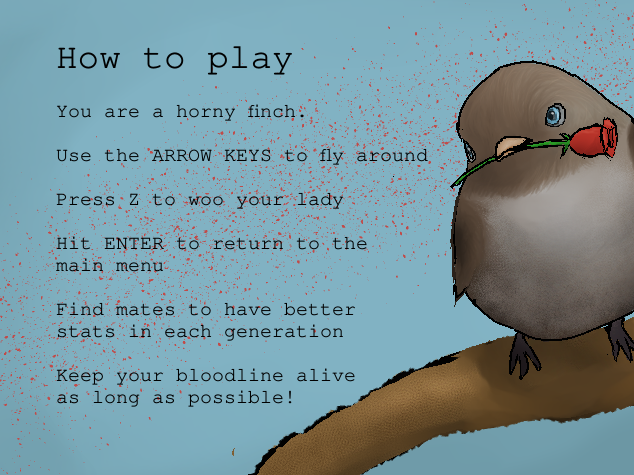

# Bird RPG Bloodlines
[PLAY THE GAEM](https://sharafian.github.io/bird-rpg-bloodlines/)

> Ludum Dare 46



# Credits
[Ben](https://twitter.com/sharafian_), [Jasmine](https://twitter.com/lacunahag), and [Nathan](https://nathanielbaum.com/) coded this.

TypeTenTC did the pixel art.

DJ Lurinym did the music (and the cat sprite).

# Local Development
- [Phaser](https://phaser.io) is the game framework
- [Typescript](https://www.typescriptlang.org/) as the language
- [Webpack](https://webpack.js.org/) ties it all together
- [Yarn](https://yarnpkg.com/) instead of npm

```
yarn
yarn build
yarn start
```
